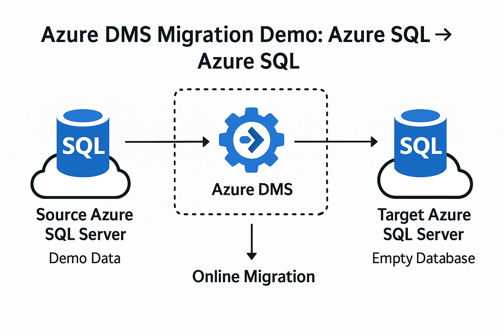

# 🛠️ Azure DMS Migration Demo: Azure SQL ➞ Azure SQL

---

<table>
<tr>
<td>

## 🎯 Objectives

This hands-on lab demonstrates a **complete online migration** of a SQL Server database from **one Azure SQL Server** to another using **Azure Database Migration Service (DMS)**.

By completing this lab, you will:

- Create a source Azure SQL Server and populate it with data.
- Create a target Azure SQL Server and empty database.
- Provision Azure DMS with required networking.
- Execute the migration using CLI and REST API.
- Validate the migration using `sqlcmd`.

</td>
<td>



</td>
</tr>
</table>


---

## ✅ Prerequisites

Ensure the following are available:

- Active Azure Subscription
- Azure CLI installed and authenticated (`az login`)
- Docker installed (for `sqlcmd` container usage)

---

## 🔧 Step 0: Set Required Variables

```bash
# Variables

# 🌎 General Azure & Networking
RESOURCE_GROUP="rg-dms-demo"
LOCATION="australiaeast"
VNET_NAME="dms-vnet"
SUBNET_NAME="dms-subnet"
SUBSCRIPTION_ID=$(az account show --query id -o tsv)
SUBNET_ID=$(az network vnet subnet show \
  --resource-group "$RESOURCE_GROUP" \
  --vnet-name "$VNET_NAME" \
  --name "$SUBNET_NAME" \
  --query "id" -o tsv)

# 🗄️ SQL Server & Database
SQL_SOURCE_NAME="sqlsource$RANDOM"
SQL_TARGET_NAME="sqltarget$RANDOM"
SQL_ADMIN_USER="sqladmin"
SQL_ADMIN_PASSWORD="P@ssw0rd$RANDOM"
SQL_DB_NAME="sqldb$(date +%s%N | sha256sum | head -c 8)"

# 🔑 Compatibility/Admin Variables
SQL_SA_USER="$SQL_ADMIN_USER"
SQL_SA_PASSWORD="$SQL_ADMIN_PASSWORD"
SQL_MI_ADMIN_USER="$SQL_ADMIN_USER"
SQL_MI_PASSWORD="$SQL_ADMIN_PASSWORD"

# ⚙️ DMS Project
DMS_NAME="dms-demo"
PROJECT_NAME="sqlmig-project"
```

---

## 🌐 Step 1: Provision DMS Infracstructure (VNet and Subnet)

```bash

# Create resource group
az group create --name $RESOURCE_GROUP --location $LOCATION

# Create VNet and delegated subnet
az network vnet create \
  --resource-group "$RESOURCE_GROUP" \
  --name "$VNET_NAME" \
  --location "$LOCATION" \
  --address-prefix 10.10.0.0/16 \
  --subnet-name "$SUBNET_NAME" \
  --subnet-prefix 10.10.1.0/24

# Delegate subnet to Microsoft.DataMigration
az network vnet subnet update \
  --resource-group "$RESOURCE_GROUP" \
  --vnet-name "$VNET_NAME" \
  --name "$SUBNET_NAME" \
  --delegations Microsoft.DataMigration/services

# Get subnet ID
SUBNET_ID=$(az network vnet subnet show \
  --resource-group "$RESOURCE_GROUP" \
  --vnet-name "$VNET_NAME" \
  --name "$SUBNET_NAME" \
  --query "id" -o tsv)
```

---

## 🧱 Step 2: Create Source SQL Server & Populate Database

```bash
# Create source SQL Server
az sql server create \
  --name "$SQL_SOURCE_NAME" \
  --resource-group "$RESOURCE_GROUP" \
  --location "$LOCATION" \
  --admin-user "$SQL_ADMIN_USER" \
  --admin-password "$SQL_ADMIN_PASSWORD"

# Create source DB
az sql db create \
  --resource-group "$RESOURCE_GROUP" \
  --server "$SQL_SOURCE_NAME" \
  --name "$SQL_DB_NAME" \
  --service-objective S0

# Allow Azure services to access
az sql server firewall-rule create \
  --resource-group "$RESOURCE_GROUP" \
  --server "$SQL_SOURCE_NAME" \
  --name AllowAllAzureIPs \
  --start-ip-address 0.0.0.0 \
  --end-ip-address 0.0.0.0

# Insert data
docker run --rm mcr.microsoft.com/mssql-tools \
  /opt/mssql-tools/bin/sqlcmd -S "$SQL_SOURCE_NAME.database.windows.net" \
  -U "$SQL_ADMIN_USER" -P "$SQL_ADMIN_PASSWORD" \
  -d "$SQL_DB_NAME" \
  -Q "CREATE TABLE Users (id INT, name NVARCHAR(50)); INSERT INTO Users VALUES (1,'Alice'), (2,'Bob');"

# Verify inserted data
docker run --rm mcr.microsoft.com/mssql-tools \
  /opt/mssql-tools/bin/sqlcmd -S "$SQL_SOURCE_NAME.database.windows.net" \
  -U "$SQL_ADMIN_USER" -P "$SQL_ADMIN_PASSWORD" \
  -d "$SQL_DB_NAME" \
  -Q "SELECT * FROM Users;"
```

---

## ☁️ Step 3: Prepare Target SQL Server

```bash
# Create target SQL Server
az sql server create \
  --name "$SQL_TARGET_NAME" \
  --resource-group "$RESOURCE_GROUP" \
  --location "$LOCATION" \
  --admin-user "$SQL_ADMIN_USER" \
  --admin-password "$SQL_ADMIN_PASSWORD"

# Create empty target DB
az sql db create \
  --resource-group "$RESOURCE_GROUP" \
  --server "$SQL_TARGET_NAME" \
  --name "$SQL_DB_NAME" \
  --service-objective S0

# Allow Azure access
az sql server firewall-rule create \
  --resource-group "$RESOURCE_GROUP" \
  --server "$SQL_TARGET_NAME" \
  --name AllowAllAzureIPs \
  --start-ip-address 0.0.0.0 \
  --end-ip-address 0.0.0.0
```

---

## 🛡️ Step 4: Register Provider and Create DMS Instance

```bash
# Register Microsoft.DataMigration provider
az provider register --namespace Microsoft.DataMigration --wait

# Create DMS instance
az dms create \
  --location $LOCATION \
  --name $DMS_NAME \
  --resource-group $RESOURCE_GROUP \
  --sku-name Standard_2vCores \
  --subnet $SUBNET_ID
```

---

## 📂 Step 5: Create Migration Project 

```bash
# Create migration project
az rest --method PUT \
  --uri "https://management.azure.com/subscriptions/$SUBSCRIPTION_ID/resourceGroups/$RESOURCE_GROUP/providers/Microsoft.DataMigration/services/$DMS_NAME/projects/$PROJECT_NAME?api-version=2022-03-30-preview" \
  --body "{\"location\": \"$LOCATION\", \"properties\": {\"sourcePlatform\": \"SQL\", \"targetPlatform\": \"SQLDB\"}}" \
  --headers "Content-Type=application/json"

# ✅ Verify the project was created
az rest --method GET \
  --uri "https://management.azure.com/subscriptions/$SUBSCRIPTION_ID/resourceGroups/$RESOURCE_GROUP/providers/Microsoft.DataMigration/services/$DMS_NAME/projects?api-version=2022-03-30-preview" \
  --query "value[].name"

# Create migration task
# Note: The Azure CLI does not support Azure SQL ➞ Azure SQL migration tasks directly.
# Use the Azure Portal UI to finish the last step: selecting source/target and starting migration.
```
---

## 🔍 Step 6: 🚧 Create Migration Task — Requires Azure Portal

⚠️ **The Azure CLI does not support creating SQL ➞ SQL DMS tasks. You must use the Azure Portal to finish the migration:**

### 👉 Steps in Portal:

1. Go to your Azure DMS instance (`$DMS_NAME`) in the Portal.
2. Under **Projects**, click your project (`$PROJECT_NAME`).
3. Click **+ New Activity** → **Offline data migration**.
4. Fill in the following:
    - **Source server name:** `$SQL_SOURCE_NAME.database.windows.net`
    - **Target server name:** `$SQL_TARGET_NAME.database.windows.net`
    - **Authentication:** Use `$SQL_ADMIN_USER` / `$SQL_ADMIN_PASSWORD`
    - **Database name:** `$SQL_DB_NAME`
5. Select `$SQL_DB_NAME` and start the migration.

---

## 🔍 Step 7: Validate in Target Server

```bash
docker run --rm -it mcr.microsoft.com/mssql-tools \
  sqlcmd -S ${SQL_TARGET_NAME}.database.windows.net \
  -U $SQL_ADMIN_USER -P $SQL_ADMIN_PASSWORD \
  -d $SQL_DB_NAME -Q "SELECT * FROM Users;"
```

---

## 🧾 Summary

| Component      | Description                            |
|----------------|----------------------------------------|
| **Source**     | Azure SQL Server (demo data)           |
| **Target**     | Azure SQL Server (empty DB)            |
| **Tool**       | Azure Database Migration Service (DMS) |
| **Method**     | Online migration (Azure ➞ Azure)       |
| **Validation** | `sqlcmd` in Docker                     |

---

🚀 This updated lab provides a 100% Azure-native, network-compatible, and DMS-supported demo without relying on local containers or hybrid setups.
